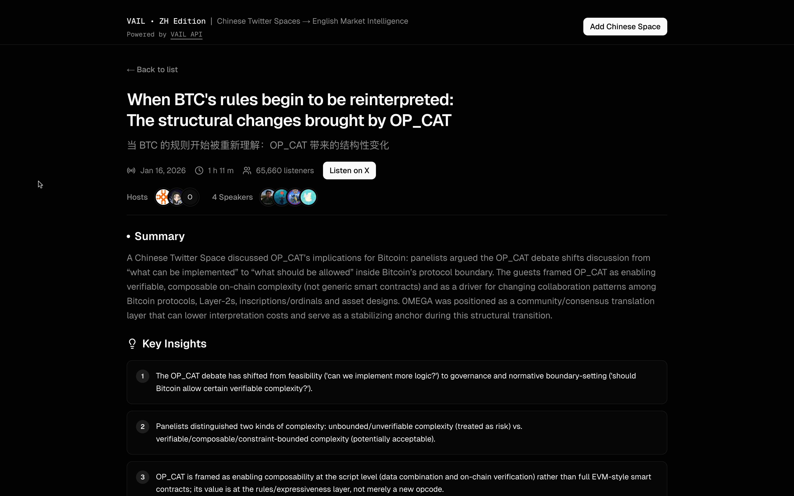

# VAIL ZH — Chinese Crypto Intelligence for Humans and Agents

Real-time market intelligence from Chinese crypto Twitter Spaces — automatically translated into structured English reports, consumable by both humans and AI agents.

🔗 **Live Demo:** [zh.vail.report](https://zh.vail.report)
📡 **Powered by:** [VAIL API](https://vail.report)


---

## What It Does

Chinese-language crypto Twitter Spaces are one of the most active and opaque corners of the market. VAIL ZH makes that intelligence accessible — to both humans browsing reports and AI agents consuming structured data.

Each Space is processed into a structured intelligence report with:

- **Summary** — High-level overview of the conversation
- **Key Insights** — The most important takeaways
- **Timeline** — Timestamped events from the Space
- **Hot Takes** — Notable quotes with speaker attribution
- **Potential Alpha** — Actionable signals and opportunities
- **Project Mentions** — Crypto projects discussed with context
- **Market Sentiment** — Overall mood and analysis

Every field is structured JSON — ready for human display or agent consumption.



---

## How It Works

VAIL ZH is the human-readable layer of a data pipeline that also serves AI agents directly via the same public API.

1. **VAIL backend** monitors Chinese Twitter Spaces, transcribes audio, translates to English, and generates structured intelligence reports using AI
2. **VAIL API** (`api.vail.report`) serves this data as structured JSON — no auth required
3. **This frontend** renders reports for human consumption via server-side rendering
4. **AI agents** can consume the same API directly for trading signals, research automation, or alerting

The app filters **VAIL** to show only: Chinese language, crypto-related, completed Spaces with published English reports.

---

## Build With VAIL Data

### For Humans — Clone & Browse

Run your own instance of VAIL ZH in under 2 minutes:

```bash
# Clone the repo
git clone https://github.com/benschiller/vail-zh.git
cd vail-zh

# Install dependencies
npm install

# Create environment file
echo "NEXT_PUBLIC_API_URL=https://api.vail.report" > .env.local

# Start the dev server
npm run dev
```

Open [http://localhost:3000](http://localhost:3000) — you should see live Chinese Spaces data. Customize the UI, reskin the branding, or run it raw for AI agents.

### For Agents — Consume the API

The VAIL API returns structured JSON that any agent framework can consume directly. No auth, no API key, no SDK required.

**Fetch pre-filtered Chinese crypto Spaces:**

```bash
curl -s https://zh.vail.report/api/spaces
```

```json
{
  "id": "1hOGkBpWvNqJy",
  "title": "聊聊最近热门的 AI Agent 项目",
  "title_en": "Discussing Recent Hot AI Agent Projects",
  "detected_language": "zh",
  "is_crypto": true,
  "state": "Ended",
  "date": 1737100800,
  "length": "1 h 17 m",
  "listeners": 4231,
  "abstract": ["This Space covered the latest developments in AI agent projects..."],
  "participants": { "admins": [...], "speakers": [...] }
}
```

> The `zh.vail.report/api/spaces` endpoint returns only Chinese crypto Spaces with published English reports.

**Get a structured intelligence report:**

```bash
curl -s https://api.vail.report/v0/spaces/{id}/report
```

```json
{
  "abstract": ["Summary paragraphs..."],
  "key_insights": ["Insight 1", "Insight 2"],
  "market_sentiment": { "overall": "bullish", "notes": "Strong optimism around..." },
  "potential_alpha": ["Alpha signal 1", "Alpha signal 2"],
  "hot_takes": [{ "text": "Quote...", "speaker": "Speaker name" }],
  "project_mentions": [{ "name": "Project X", "context": "Discussed as..." }],
  "timeline": [{ "event": "...", "start_time_ms": 0, "significance": "..." }]
}
```

**Agent use cases:**
- 🤖 **Trading agents** — Parse `market_sentiment` and `potential_alpha` as input signals
- 📊 **Research agents** — Track `project_mentions` across multiple Spaces over time
- 🚨 **Alert agents** — Monitor for specific keywords or sentiment shifts in `key_insights`
- 🔗 **Multi-source agents** — Combine VAIL data with onchain data for richer context

Works with any agent framework: OpenClaw, LangChain, CrewAI, AutoGPT, or plain HTTP.

---

## Tech Stack

| Layer | Technology |
|-------|-----------|
| Framework | [Next.js 16](https://nextjs.org/) (App Router, SSR) |
| Language | TypeScript |
| UI | [Tailwind CSS](https://tailwindcss.com/) + [shadcn/ui](https://ui.shadcn.com/) + [Radix UI](https://www.radix-ui.com/) |
| Fonts | Geist Sans, Geist Mono |
| Analytics | [Umami](https://umami.is/) |
| Hosting | AWS Amplify (WEB_COMPUTE) |
| Data | [VAIL API](https://vail.report) (public, no auth required) |

---

## Project Structure

```
vail-zh/
├── app/
│   ├── page.tsx                      # Home — Spaces list
│   ├── spaces/[id]/page.tsx          # Individual report page
│   ├── api/spaces/route.ts           # Pagination proxy
│   ├── api/spaces/[id]/listen/       # Listen URL proxy
│   ├── not-found.tsx                 # 404 page
│   └── layout.tsx                    # Root layout
├── components/
│   ├── header.tsx                    # App header
│   ├── footer.tsx                    # App footer
│   ├── space-card.tsx                # Space list item
│   ├── spaces-list.tsx               # Spaces list with pagination
│   ├── report-display.tsx            # Full report renderer
│   └── ui/                           # shadcn/ui primitives
├── lib/
│   ├── api.ts                        # VAIL API client
│   ├── types.ts                      # TypeScript interfaces
│   ├── format.ts                     # Date, duration, participant formatting
│   └── utils.ts                      # Tailwind utilities
└── public/images/                    # Screenshots
```

---

## API Reference

VAIL ZH exposes these endpoints at `zh.vail.report`:

| Endpoint | Description |
|----------|-------------|
| `GET /api/spaces` | Pre-filtered Chinese crypto Spaces with pagination |
| `GET /api/spaces/{id}/listen` | Get Twitter/X listen URL for a Space |

And consumes this from the `api.vail.report`:

| Endpoint | Description |
|----------|-------------|
| `GET /v0/spaces/{id}/report` | Get structured intelligence report |

No authentication required. All endpoints return JSON.

---

## Built with AI

This entire application was built using AI-assisted development — from architecture design to implementation to security review.

**Tools used:**
- [Anthropic](https://www.anthropic.com/) (Claude Opus + Sonnet)
- [Cline](https://github.com/cline/cline) (VS Code AI agent)

**How AI was used at every stage:**

1. **Architecture** — AI designed the component structure, data flow, and SSR strategy
2. **Implementation** — All components, API client, types, and formatting utilities were written through AI pair programming
3. **Iteration** — Route restructuring, bearer token removal, branding updates — all driven by conversational AI collaboration
4. **Deployment** — AWS Amplify configuration and troubleshooting done through AI guidance
5. **Security review** — Pre-public audit: checked git history for leaked secrets, reviewed API routes, identified stale docs and dead links
6. **Documentation** — This README was written by AI after reviewing the full codebase

The commit history tells the story: 14 commits from scaffolding to production, each one an AI-human collaboration.

---

## Future Development

- [ ] Agent SDK / wrapper for popular frameworks (LangChain, AI SDK, CrewAI)
- [ ] Webhook and streaming support for real-time agent consumption
- [ ] Onchain attestation of report data for verifiability
- [ ] OpenGraph metadata for social sharing previews
- [ ] Customizable themes and branding (reskin support)
- [ ] User-submitted Space requests — add your own Spaces for processing
- [ ] Configurable gate filters — build frontends for other languages and topics
- [ ] Real-time monitoring of live Spaces
- [ ] Multi-language report output (not just ZH→EN)
- [ ] Embeddable report widgets

---

## License

[MIT](LICENSE)

---

<p align="center">
  <strong>VAIL ZH</strong> — Built by <a href="https://twitter.com/benschiller_xyz">@benschiller_xyz</a> at General Artificial Intelligence Labs 🇦🇪
</p>
